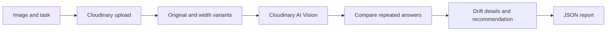

# InvariantLens

**Optimize pixels. Preserve meaning.**

Test whether image optimization changes the answers your AI application needs. InvariantLens compares repeated Cloudinary AI Vision results across image sizes, highlights answer drift, and recommends the smallest passing tested width.

**[Launch the live app](https://invariantlens-sprintx.onrender.com/)** | **[Watch the demo](https://youtu.be/se1mskAHHnA)** | [Quick start](#quick-start) | [Experiment evidence](#recorded-receipt-experiment) | [Report an issue](https://github.com/HackIndiaXYZ/pixels-to-products-cloudinary-ai-hackathon-2026-sprintx/issues)

Built by **SprintX - Ragav and Sanjit** for **Pixels to Products - Cloudinary AI Hackathon 2026**, **PS-01: AI Media Pipelines**.

> **Project status:** Experimental MVP. Recommendations apply to the tested image, task, and configuration. Agreement across repeated runs does not establish accuracy or universal safety.

## Demo video

[](https://youtu.be/se1mskAHHnA)

Click the preview to play the video on YouTube, or [open the deployed workspace](https://invariantlens-sprintx.onrender.com/) to explore the app.

## Features

- Repeat the original task three times before comparing transformed images.
- Test text preservation, object counts, or custom structured questions.
- Inspect field-level changes across five width presets.
- Require a manually checked reference before recommending a receipt preset.
- Export the experiment, decisions and available raw responses as JSON.
- Explore recorded examples without credentials or AI calls.

## Contents

- [The problem](#the-problem)
- [How it works](#how-it-works)
- [Quick demo](#quick-demo)
- [Recorded receipt experiment](#recorded-receipt-experiment)
- [Quick start](#quick-start)
- [How to use](#how-to-use)
- [Cloudinary integration](#cloudinary-integration)
- [Decision rules](#decision-rules)
- [Architecture](#architecture)
- [Development and validation](#development-and-validation)
- [Render deployment](#render-deployment)
- [Limitations and data handling](#limitations-and-data-handling)
- [Contributing and support](#contributing-and-support)
- [License](#license)

## The problem

An optimized image may look acceptable while losing small details that a downstream AI task needs. AI answers can also vary even when the image has not changed. InvariantLens measures baseline repeatability before reporting transformation-associated changes.

### Value for Cloudinary developers

InvariantLens helps developers choose image transformations using observed AI results. Cloudinary provides the upload, transformations, and AI analysis in one workflow; InvariantLens compares the responses and preserves the evidence in an exportable report. This supports evaluation of receipt extraction, text recognition, and object-counting tasks before choosing delivery settings.

## How it works



1. **Define the task.** Choose the information that should survive optimization.
2. **Establish the baseline.** Analyze the original three times. Only stable fields are compared.
3. **Test smaller versions.** Apply `c_limit,w_<width>/q_auto` and analyze each eligible variant three times.
4. **Inspect the result.** Review changed answers and the smallest passing tested width. Partial or invalid evidence cannot produce a complete task recommendation.

## Quick demo

1. Open the [deployed workspace](https://invariantlens-sprintx.onrender.com/).
2. Explore **Recorded examples** to inspect baseline stability, drift and missing evidence without using the API.
3. For receipts, choose **Live analysis → Sample library → Receipt 01**. The suggested task asks for the final purchase total.
4. Inspect the original image. Enter `16.69` and `EUR` as the manually checked reference before a fresh receipt test. These values are excluded from the AI prompt.
5. Run the test, inspect each width and export the report. Fresh runs use Cloudinary allowance and may differ from the saved experiment.

## Recorded receipt experiment

The saved screening on 30 September 2026 tested three original runs, then three runs each at eligible **600px and 200px** widths for stable, nonempty originals. These two widths are a subset of the workspace's five presets.

| Receipt 01 | Run 1 | Run 2 | Run 3 |
| --- | --- | --- | --- |
| Original | 16.69 | 16.69 | 16.69 |
| 600px | 16.69 | 16.69 | 16.69 |
| 200px | 40.14 | 40.16 | 40.16 |

The [original Receipt 01 image](public/validation/receipt-01.jpg) shows **EUR 16.69**. In this recorded experiment, 600px preserved that total and 200px changed it. The expected answer was not included in the prompt.

Across **10 receipts**, **9** had stable original totals and **7** preserved their baseline amount at 200px. Receipt 10 returned three empty original answers, so smaller widths were not tested. Receipt 08 returned invalid results at 600px but passed at 200px; results need not be monotonic.

These counts measure agreement, not independently verified accuracy across all ten receipts. Width and `q_auto` change together. Three repeats and a small sample cannot establish production failure rates or universal safe settings.

Evidence: [saved observations](public/validation/results.json), [screening notes](docs/IMAGE-VALIDATION.md), [image provenance and licenses](public/validation/ATTRIBUTION.md), [receipt safeguards](docs/RECEIPT-SAFEGUARDS.md).

## Quick start

Use **Node.js 24** and npm for the app and validation scripts. Next.js itself requires Node.js 20.9 or later; the receipt scripts also import TypeScript directly using Node's type stripping.

```sh
git clone https://github.com/HackIndiaXYZ/pixels-to-products-cloudinary-ai-hackathon-2026-sprintx.git
cd pixels-to-products-cloudinary-ai-hackathon-2026-sprintx
npm ci
npm run dev
```

Open [the local workspace](http://127.0.0.1:3000). Recorded examples work without credentials.

### Enable live analysis

For live analysis, copy `.env.example` to `.env.local`, enter **newly rotated** Cloudinary credentials, set `CLOUDINARY_CREDENTIALS_ROTATED=true`, and enable the **AI Vision add-on**. Restart after editing the environment. Never commit `.env.local` or reuse the exposed secret.

| Server variable | Purpose |
| --- | --- |
| `CLOUDINARY_CLOUD_NAME` | Cloudinary product environment |
| `CLOUDINARY_API_KEY` | API key for that environment |
| `CLOUDINARY_API_SECRET` | Secret for the same environment; never expose to the browser |
| `CLOUDINARY_CREDENTIALS_ROTATED` | Must be `true` after credential rotation |

For a local production run:

```sh
npm run build
npm start
```

## How to use

1. Explore the recorded storefront, desk and cyclist examples.
2. Switch to **Live analysis** and choose a JPEG, PNG or WebP under 4 MB.
   Or open **Sample library** to load a supplied image and suggested task. Receipt samples include historical screening status; selecting a sample does not load historical results into the live matrix.
3. Choose text preservation or object counting and enter comma-separated phrases or objects. Choose **Create your own checks** for a guided task builder: name your task, add instructions, and add up to 12 questions with Yes/No, Count or Text answers. Field keys are generated automatically. **Advanced: edit JSON** supports existing schemas; apply validates changes, while cancel preserves the form. Incomplete questions block a test.
4. Run the stress test. The original and every eligible preset each receive three analyses, up to 18 API calls. Presets equal to or wider than the source are skipped.
5. Inspect the comparison matrix and click a width to see exact changes.
6. Export the JSON report, including raw responses when available.

Images remain in your Cloudinary account until you remove them. Reports stay in browser memory; export before refreshing.

For receipt tasks, enter a total and three-letter currency code after reading the original. A missing reference, invalid currency code, or total that differs from the baseline blocks recommendations. The expected total and currency are retained in the report and excluded from the provider prompt.

## Cloudinary integration

- Official Node SDK uploads images server-side.
- Signed, expiring upload tokens limit analysis to assets uploaded through the app.
- Explicit transformations: `c_limit,w_<preset>/q_auto` at 1200, 800, 600, 400 and 200px. Original format is retained; `f_auto` is omitted to avoid client-dependent format negotiation.
- AI Vision General uses a JSON Schema inside the prompt, with asynchronous task polling and a 50-second timeout.
- Secrets and authenticated calls stay on the server.

References: [Analyze API](https://cloudinary.com/documentation/analyze_api_reference), [Analyze API guide](https://cloudinary.com/documentation/analyze_api_guide), [AI Vision add-on](https://cloudinary.com/documentation/cloudinary_ai_vision_addon).

## Decision rules

- **STABLE**: all three valid baseline outputs agree after conservative string normalization.
- **UNSTABLE**: baseline answers differ, or reported model versions change.
- **PASS**: every selected field has a stable baseline and matches in all three valid variant runs.
- **PARTIAL**: comparable fields match, but some original fields are unstable or invalid. No full-task width recommendation is issued.
- **DRIFT**: at least one stable field changes in at least one valid variant run; all values remain visible.
- **ERROR**: incomplete runs, API/schema failures, no stable fields or an incompatible reported model version.
- **Not tested**: no measurements are available.

The recommendation is the **smallest passing tested width**, not the fewest bytes. A smaller width can pass after a larger one fails. Stable output is not ground truth; three repeats do not establish statistical certainty. Unstable fields are excluded and visible. Unknown model versions are recorded as unavailable.

### Recorded example provenance

The storefront, desk, and cyclist examples are historical handoff observations. Their exact prompts, raw responses, dates, and model versions are unavailable, and the supplied photos were added later. Treat those examples as interface demonstrations, not independently reproduced measurements.

See the [mock-data audit](docs/MOCK-DATA-AUDIT.md) for fixed example outputs and fixtures, and [sample attribution](public/samples/ATTRIBUTION.md) for image sources and upload limits.

## Architecture

**Stack:** Next.js App Router, React, TypeScript, Tailwind CSS, Cloudinary Node SDK, Zod, and Vitest. The MVP has no database or user authentication system.

```text
Browser: choose image + task + optional receipt reference
  → /api/upload: validate image, upload to Cloudinary, sign asset token
  → /api/analyze: verify token, build transformation, call AI Vision
  → Browser: compare repeated outputs, apply reference safeguards
  → /api/report: return a downloadable JSON report
```

- `src/components/Workspace.tsx`: upload, progress, examples, inspection and export.
- `src/lib/domain.ts`: task validation, baseline, drift and recommendation.
- `src/lib/server.ts`: credentials, signed tokens, URLs and request guards.
- `src/lib/vision.ts`: AI Vision and structured responses.
- `src/app/api`: upload, analyze and status routes.
- `public/validation`: receipt images, hashes, attribution and saved screening results.

The browser orchestrates individual analysis requests. Server routes upload media, authenticate provider calls, and return results. The MVP has no persistent job queue; reports remain in browser memory until exported.

## Development and validation

```sh
npm test
npm run typecheck
npm run build
```

Tests cover unstable baselines, errors, repeated runs, model changes, schemas, missing evidence and non-monotonic recommendations. Live verification requires configured credentials and the add-on.

With the app running, the live integration check can be run against the public sample:

```sh
node scripts/live-smoke.mjs public/samples/safety-sign.jpg "CAUTION,NO SMOKING,MATCHES,OPEN LIGHTS"
```

This uploads one image and uses up to 18 real AI Vision calls. It saves raw observations and decisions in ignored `artifacts/live-check/report.json`. It stops at the first API error, preserving completed observations. No credentials or upload tokens are saved in the report.

For one receipt against the deployed app (PowerShell, up to nine paid provider calls):

```powershell
$env:TEST_BASE_URL = "https://invariantlens-sprintx.onrender.com"
$env:RECEIPT_IDS = "receipt-01"
node scripts/validate-receipts.mjs
```

This preserves a fresh report in a timestamped ignored `artifacts/receipt-validation-*` directory. It does not replace the saved screening dataset. Review its `summary.json` and any `error` fields: the batch script can finish with exit code zero after recording a provider failure.

## Render deployment

**Public deployment:** [invariantlens-sprintx.onrender.com](https://invariantlens-sprintx.onrender.com/).

Deploy this repository as a **Node web service**, with Node 24 and these commands:

| Setting | Value |
| --- | --- |
| Build command | `npm ci && npm run build` |
| Start command | `npm start` |
| Health path | `/api/status` |
| Environment | All four Cloudinary variables listed above |

The start script binds to `0.0.0.0`; Next.js uses the host's `PORT` environment variable. Server routes require a Node runtime and requests long enough for provider polling. A static-only host cannot run the upload and analysis routes.

`/api/status` returning `{"configured":true}` confirms that environment values are present; it does **not** verify provider credentials, add-on access or remaining quota. Rehearse a real upload and analysis before recording. Open the service ahead of the take and wait for the page to become interactive.

## Troubleshooting

| Symptom | Check |
| --- | --- |
| Live analysis unavailable | Environment variables, rotation flag and service restart |
| Upload rejected | JPEG/PNG/WebP, maximum 4 MB, valid credentials |
| Quota or rate-limit error | Provider allowance; wait for request-rate limits or resolve account quota |
| No receipt recommendation | All original runs valid and stable; manually checked total and currency match |
| A width says Not tested | It was skipped, the run stopped, or no recorded evidence exists |
| Page visible but controls do not respond | Reload after loading finishes; inspect browser errors and JavaScript requests before recording |

## Limitations and data handling

- **Scope:** Results cover one image, task, and tested configuration. Stable answers can still be wrong; three repeats do not establish statistical certainty.
- **Provider variation:** Unknown model versions are recorded as unavailable. Identical underlying models cannot be independently verified when the provider does not report a version.
- **Receipt scope:** Monetary comparison supports two fractional digits. The reviewer supplies the currency; the app does not independently verify or convert it.
- **Image retention:** Uploaded images remain in your Cloudinary account until removed. Delivery URLs are accessible to anyone with the link.
- **Report retention:** Export before refreshing. Review reports for image URLs or private content before sharing them.
- **Request lifecycle:** Stop prevents later requests; already accepted provider requests may still complete and consume allowance.
- **Deployment controls:** Rate limits are best-effort and per-process. Broader deployments need suitable access controls and provider spending limits.

## Contributing and support

Maintained by **SprintX - Ragav and Sanjit**. [Open an issue](https://github.com/HackIndiaXYZ/pixels-to-products-cloudinary-ai-hackathon-2026-sprintx/issues) for bugs or questions. Include reproduction steps, the task and width involved, and a redacted report where useful.

For contributions, create a branch, explain the behavior being changed, and run the tests, type checking, and production build before opening a pull request. Keep evidence provenance explicit: preserve observed disagreements and distinguish historical examples from fresh measurements. Never commit credentials, upload tokens, or private images.

Further reading: [Baseline review](docs/BASELINE-REVIEW.md) | [Receipt safeguards](docs/RECEIPT-SAFEGUARDS.md) | [Mock-data audit](docs/MOCK-DATA-AUDIT.md)

## License

Code is distributed under the [MIT License](LICENSE). Sample images have separate terms documented in [sample attribution](public/samples/ATTRIBUTION.md) and [receipt attribution](public/validation/ATTRIBUTION.md).
